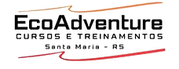

# 🚨 Formação Profissional de Resgatistas - Desde 2005



## 📋 Sobre o Projeto

Somos uma das pioneiras no ramo de treinamentos de Atendimento Pré-Hospitalar (APH) há 20 anos, trazendo conhecimento, educação e inovação para a formação de resgatistas. Nossa missão é capacitar profissionais com as habilidades necessárias para salvar vidas em situações de emergência.

## ✨ Funcionalidades Principais

- **🏥 Catálogo de Cursos:** Explore nossa variedade de cursos de formação para resgatistas
- **📱 Design Responsivo:** Interface adaptável para desktop e dispositivos móveis usando Tailwind CSS

## 🏗️ Estrutura do Projeto

```
ecoadventuresm/
├── public/               # Arquivos públicos estáticos
├── src/
│   ├── components/       # Componentes reutilizáveis
│   │   ├── Courses/      # Componentes relacionados aos cursos
│   │   ├── Layout/       # Componentes de estrutura da página
│   │   └── UI/           # Elementos de interface do usuário
│   ├── context/          # Providers de contexto React
│   ├── pages/            # Páginas da aplicação
│   ├── services/         # Serviços e conexões com APIs
│   └── styles/           # Estilos globais
└── README.md             # Esta documentação
```

## 🚀 Como Começar

### Pré-requisitos

- Node.js (v14.x ou superior)
- npm ou yarn

### Instalação

1. Clone o repositório:
   ```bash
   git clone https://github.com/seu-usuario/ecoadventuresm.git
   ```

2. Acesse a pasta do projeto:
   ```bash
   cd ecoadventuresm
   ```

3. Instale as dependências:
   ```bash
   npm install
   # ou
   yarn install
   ```

4. Inicie o servidor de desenvolvimento:
   ```bash
   npm start
   # ou
   yarn start
   ```

5. Acesse a aplicação em `http://localhost:3000`

## 🌟 Como Usar

- Navegue pelo **Catálogo de Cursos** disponíveis
- Clique em um curso para ver mais **Detalhes**, incluindo conteúdo programático e datas
- Entre em contato através do formulário para mais informações ou inscrições
- Acesse nossa seção de **FAQ** para sanar dúvidas comuns

## 💯 Por Que Escolher Nossa Formação?

- **Experiência:** 20 anos formando profissionais qualificados no mercado
- **Instrutores Especializados:** Profissionais com vasta experiência prática em resgate
- **Certificação Reconhecida:** Certificados com validade e reconhecimento no mercado
- **Infraestrutura Completa:** Salas equipadas e ambientes de simulação realistas

## 🤝 Contribuindo

Adoraríamos sua contribuição! Sinta-se à vontade para:

1. Reportar bugs
2. Sugerir novas funcionalidades
3. Enviar pull requests

## 📄 Licença

Este projeto está licenciado sob a Licença MIT - veja o arquivo LICENSE para detalhes.

---

🚑 **Formação Profissional de Resgatistas** - Formando profissionais preparados para salvar vidas desde 2005